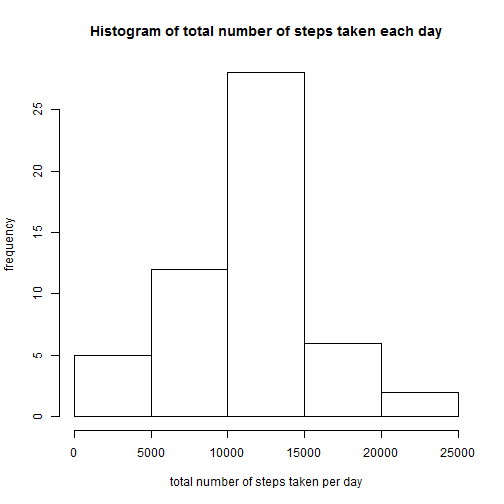
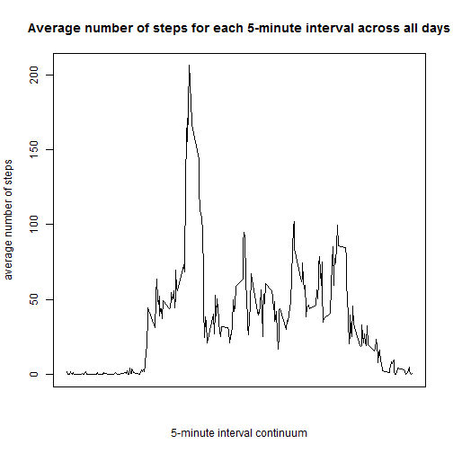
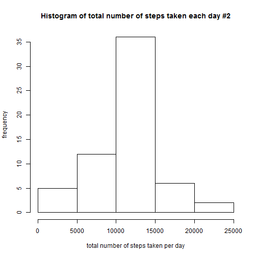
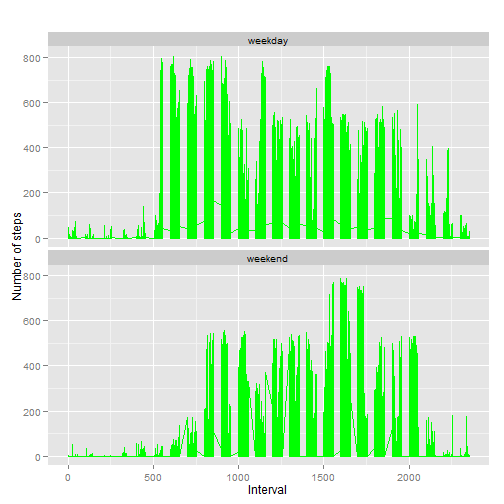

###Loading and reprocessing the data
Here I did not consider necessary to reprocess the data. It will be reprocessed as we go along. You can consider that `file<-"https://d396qusza40orc.cloudfront.net/repdata%2Fdata%2Factivity.zip" download.file(file, destfile="RRP1.zip") unzip("RRP1.zip")` were done previously before all the code you will see. Somehow knitr didn't accept this code within the form of r chunks. Please comment on this in my evaluation if you want to help :).

Here's the code for "loading" the data

```r
data<-read.csv("activity.csv")
```
I did not consider necessary to reprocess the data. It will be reprocessed as we go along. 

###What is mean total number of steps taken per day?

Here we only need data for the dates and number of steps. I also transform
the data set so that only complete cases are in it. 

```r
#make the new data set
newdata<-data[1:2]
completedata<-na.omit(newdata)
#make the vectors needed for the rowsum function
steps<-completedata[[1]]
date2<-completedata[[2]]
#get the mean total number of steps taken per day
stepsperday<-rowsum(steps,date2)
#transform the result into a vector for the histogram
stepsvec<-as.vector(stepsperday)
#make the histogram
hist(stepsvec, main="Histogram of total number of steps taken each day", 
     ylab="frequency", xlab="total number of steps taken per day")
```

 

```r
#get also the mean and median total number of steps taken per day
mean(stepsvec)
```

```
## [1] 10766.19
```

```r
median(stepsvec)
```

```
## [1] 10765
```
The mean total number of steps taken per day is `10766.19` and the median is `10765`.  

###What is the average daily activity pattern?
To make the plot, I decided to take the dataset with complete cases only again. This step is simple as you only have to aggregate (i.e. `aggregate()`) the dataset by the interval variable `by=list(interval)` and by using the mean (`FUN="mean"`) function. You can than create the plot easily afterward. The 5-minute interval containing the maximum number of steps on average is created by transforming the steps column of 'datagg2' into a vector and using the `max()` function on this vector. With the
result of the max function on the vector, you can than find the line that is equal to that result in your data set and identify the 5-minute interval with maximum of steps.


```r
#use only complete cases
completedata<-na.omit(data)
#we will need the interval data as a vector for the aggregate function
interval<-completedata[[3]]
#create the new data set with the mean number of steps for every 5-minute interval
datagg2<-aggregate(completedata, by=list(interval), FUN="mean")
#create the plot with the new dataset
plot(steps ~ interval, datagg2, xaxt = "n", 
     type = "l",xlab="5-minute interval continuum",ylab="average number of steps", 
     main="Average number of steps for each 5-minute interval across all days")
```

 

```r
#the 5-minute interval containing the maximum number of steps on average
dataggsteps<-datagg2[[2]]
maxsteps<-max(dataggsteps)
datagg2[(datagg2$steps == maxsteps),]
```

```
##     Group.1    steps date interval
## 104     835 206.1698   NA      835
```
The 5-minute interval containing the maximum number of steps is `835`.

###Imputing missing values
With the following code chunk you can see how many missing value there is per column, or for each variable. 

```r
colSums(is.na(data))
```

```
##    steps     date interval 
##     2304        0        0
```

Now we need to decide on which strategy we will use to replace the missing values. 
I chose to replace the missing values by the mean number of steps for each 
5-minute interval across all days associated with the missing steps value.
To do that, we will need the datagg2 dataset created for the previous step that 
contains all the mean number of steps for each 5-minute interval across all days.
Here's how to create the dataset with replaced missing values.


```r
for (i in 1:nrow(data)){
  if (is.na(data$steps[i])){
    intervalval <- data$interval[i]
    rownum <- which(datagg2$interval == intervalval)
    stepsval <- datagg2$steps[rownum]
    data$steps[i] <- stepsval
    }
  }
```

To make the histogram, you can than use the same strategy as for the first question
of the assignment.


```r
newdata<-data[1:2]
completedata<-na.omit(newdata)
steps<-completedata[[1]]
date2<-completedata[[2]]
stepsperday<-rowsum(steps,date2)
stepsvec<-as.vector(stepsperday)
hist(stepsvec, main="Histogram of total number of steps taken each day #2",ylab="frequency", xlab="total number of steps taken per day")
```

 

```r
mean(stepsvec)
```

```
## [1] 10766.19
```

```r
median(stepsvec)
```

```
## [1] 10766.19
```
The impact of imputing missing values doesn't seem to affect much the data on a mean 
and median standpoint. The mean stayed the same and so the median. However, it seems 
like the frequency of cases who walked between 10000 and 15000 steps per day has 
augmented. It is logic due to the fact that many NA values now adopt mean values for 
their associated 5-minute interval, which may lead to an increase of the frequency of 
cases that have walked a total number of steps "around the mean" of `10766.19`.


###Are there differences in activity patterns between weekdays and weekends?
For this part, we first need to transform the date data into *real* date data 
(i.e. `as.Date(%Y-%m-%d)`). Second, the `weekdays()` function will than help create the 
data assigning weekday names  to each cases of the dataset (lundi à dimanche (monday to 
sunday), note that my R version is in french)  and will be assigned to a new variable 
`day`.  Third, we will create a new variable assigning the label **weekday** to all
cases. We will finally replace the weekday label for **weekend** for weekend days cases 
with a for loop. Here is how I proceed:


```r
data$date<-as.Date(data$date,"%Y-%m-%d")
data$day<-weekdays(data$date)
data$day_type <- c("weekday")
for (i in 1:nrow(data)){
  if (data$day[i] == "samedi" || data$day[i] == "dimanche"){
      data$day_type[i] <- "weekend"
  }
}
```

Finally, we will need the package `ggplot2` for the last plot. 

```r
library(ggplot2)
```

```
## Warning: package 'ggplot2' was built under R version 3.1.2
```

```r
qplot(interval, steps, data=data, geom=c("line"), xlab="Interval", 
      ylab="Number of steps", main="") + facet_wrap(~ day_type, ncol=1) + geom_line(colour="green",linetype=1)
```

 


